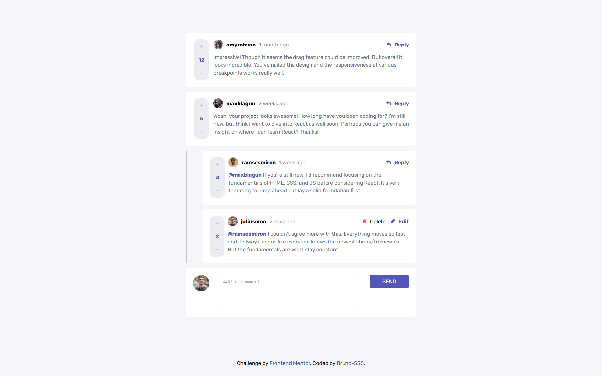

<h1 align="center"> Comments 💻 </h1>

## Status 🔧

Currently under development.

## Requirements 📄

FrontendMentor challenge requirements:

- Create, Read, Update, and Delete comments and replies
- Upvote and downvote comments
- View the optimal layout for the app depending on the device's screen size
- See hover states for all interactive elements on the page
- Bonus: If you're building a purely front-end project, use localStorage to save the current state in the browser that persists when the browser is refreshed

## Alerts ⚡

- > [FrontendMentor Challenge Page](https://www.frontendmentor.io/challenges/interactive-comments-section-iG1RugEG9)

- > [Live Project Link](https://comments1.netlify.app/)

## Goal 📌

- Project to be added to my angular portfolio.

---

<h3 align="center"> Home 📷 </h3>

    

<h3 align="center"> Tecnologias utilizadas 🤖 </h3>

> 

>   
>   
> 

